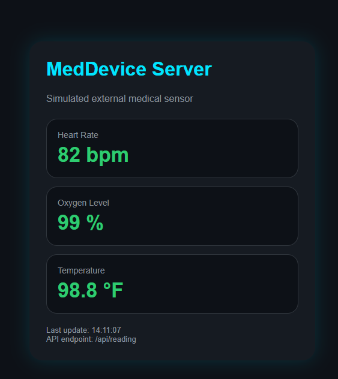
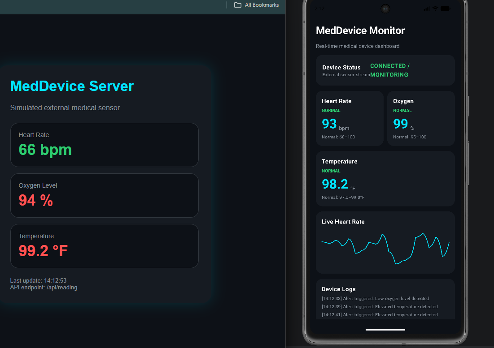
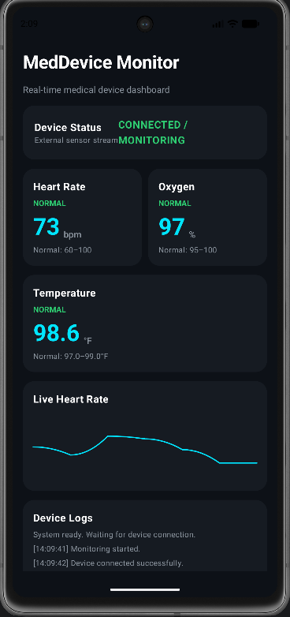
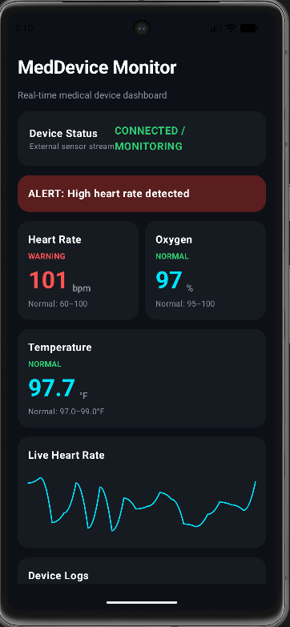

# Medical Device Monitor (Kotlin + Simulator)

Real-time vital signs monitoring system built with a Kotlin Android app and a simulated external medical device.

---

## Overview

This project demonstrates a complete **device-to-app data pipeline**:

* A **Python Flask simulator** acts as a medical device generating live vital signs
* A **Kotlin Android app** consumes and visualizes the data in real time
* Alert logic detects abnormal readings (heart rate, oxygen, temperature)

The system is designed to mimic how real medical hardware communicates with software systems during development and testing.

---

## Features

* Real-time streaming of:

  * Heart Rate (BPM)
  * Oxygen Level (%)
  * Temperature (°F)
* Live UI updates in Kotlin app
* Alert system:

  * High heart rate (>100 bpm)
  * Low oxygen (<95%)
  * High temperature (>99°F)
* Simulated external device (Flask server)
* REST API endpoint for readings

---

## Architecture

```text
[ Flask Simulator ]  --->  [ HTTP API ]  --->  [ Kotlin Android App ]
   (Python)             /api/reading         (Live Monitoring UI)
```

---

## Simulator (Fake Medical Device)

The simulator generates randomized vital signs every second and exposes them via HTTP.

### Endpoints

* `/api/reading` → JSON data
* `/raw` → lightweight string format

Example response:

```json
{
  "heartRate": 78,
  "oxygenLevel": 97,
  "temperature": 98.4,
  "timestamp": "14:32:10"
}
```

---

## How to Run the Simulator

```bash
cd simulator
pip install -r requirements.txt
python app.py
```

Open in browser:

```
http://localhost:5000
```

---

## Android App

The Kotlin app connects to the simulator and displays live readings with alert indicators.

> Currently uses HTTP polling. BLE integration planned.

---

## Screenshots

### Device Server (Simulated Sensor)


### Android App Dashboard


### Normal Monitoring State


### Alert State (Abnormal Readings)


## Tech Stack

* Kotlin (Android)
* Python
* Flask
* REST API
* Coroutines / Flow (Android)

---

## Future Improvements

* BLE (Bluetooth Low Energy) device communication
* Real sensor integration (Arduino / ESP32)
* Data persistence and history charts
* Smoother animated graphs
* Authentication & device identification

---

## Purpose

This project simulates a real-world scenario where software must integrate with external hardware devices, focusing on:

* Real-time data handling
* UI responsiveness
* Fault/alert detection
* System architecture

---

## Author

Angelo R. Dibello


